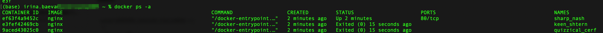
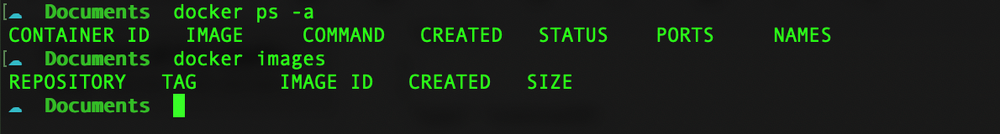
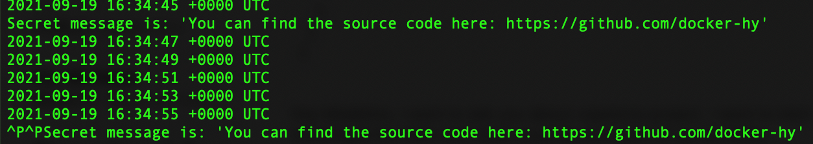
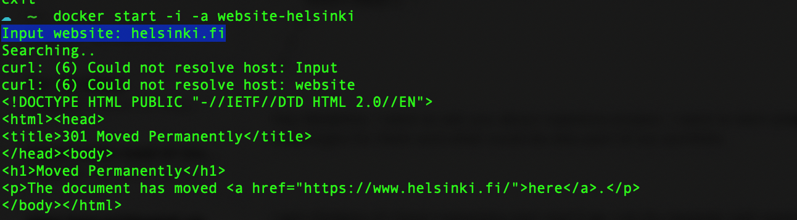
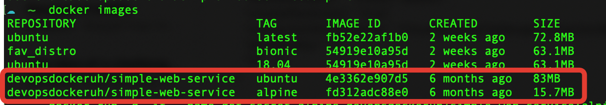
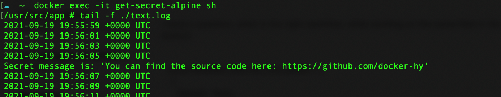
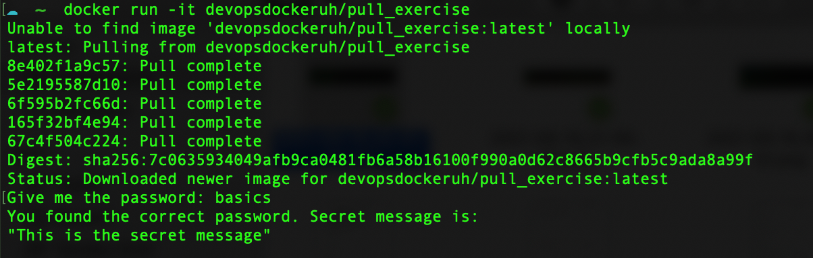

## PART 1

### 1.1: Getting started

> Start 3 containers from image that does not automatically exit, such as nginx, detached. Stop 2 of the containers leaving 1 up. Submit the output for docker ps -a which shows 2 stopped containers and one running.

```
docker container run -d nginx 
docker container run -d nginx
docker container run -d nginx

docker container stop 9ac e3f

docker ps -a
```


### 1.2: Cleanup

> Clean the docker daemon from all images and containers.

```
docker container stop ef6
docker container rm 9ac e3f ef6

docker ps -a
docker images
```


### 1.3: Secret message

> Image devopsdockeruh/simple-web-service:ubuntu will start a container that outputs logs into a file. Go inside the container and use tail -f ./text.log to follow the logs. Every 10 seconds the clock will send you a “secret message”.

```
docker run -d -it --name get-secret devopsdockeruh/simple-web-service:ubuntu
docker exec -it get-secret bash 
```
inside the container run
```
tail -f ./text.log
```
Secret message is: 'You can find the source code here: https://github.com/docker-hy'



### 1.4: Missing dependencies

>Start a ubuntu image with the process sh -c 'echo "Input website:"; read website; echo "Searching.."; sleep 1; curl http://$website;' You will notice that a few things required for proper execution are missing. Be sure to remind yourself which flags to use so that the read actually waits for input.

```
docker run -d -it --name website-helsinki ubuntu sh -c 'echo "Input website:"; read website; echo "Searching.."; sleep 1; curl http://$website;'

docker exec -it website-helsinki bash
```
inside the container run
```
apt-get update
apt-get install curl
exit
```

```
docker start -i -a website-helsinki
Input website: helsinki.fi
```



### 1.5: Sizes of images

>In a previous exercise we used devopsdockeruh/simple-web-service:ubuntu. Here is the same application but instead of ubuntu is using alpine: devopsdockeruh/simple-web-service:alpine. Pull both images and compare the image sizes. Go inside the alpine container and make sure the secret message functionality is the same. Alpine version doesn’t have bash but it has sh.

```
docker pull devopsdockeruh/simple-web-service:alpine
docker images 
```


```
docker run -d -it --name get-secret-alpine devopsdockeruh/simple-web-service:alpine
docker exec -it get-secret-alpine sh 
```
inside the container run
```
tail -f ./text.log
```
Secret message is: 'You can find the source code here: https://github.com/docker-hy'



### 1.6: Hello Docker Hub

>Run docker run -it devopsdockeruh/pull_exercise. It will wait for your input. Navigate through docker hub to find the docs and Dockerfile that was used to create the image. Read the Dockerfile and/or docs to learn what input will get the application to answer a “secret message”.

```
docker run -it devopsdockeruh/pull_exercise
```
Secret message is: "This is the secret message"



